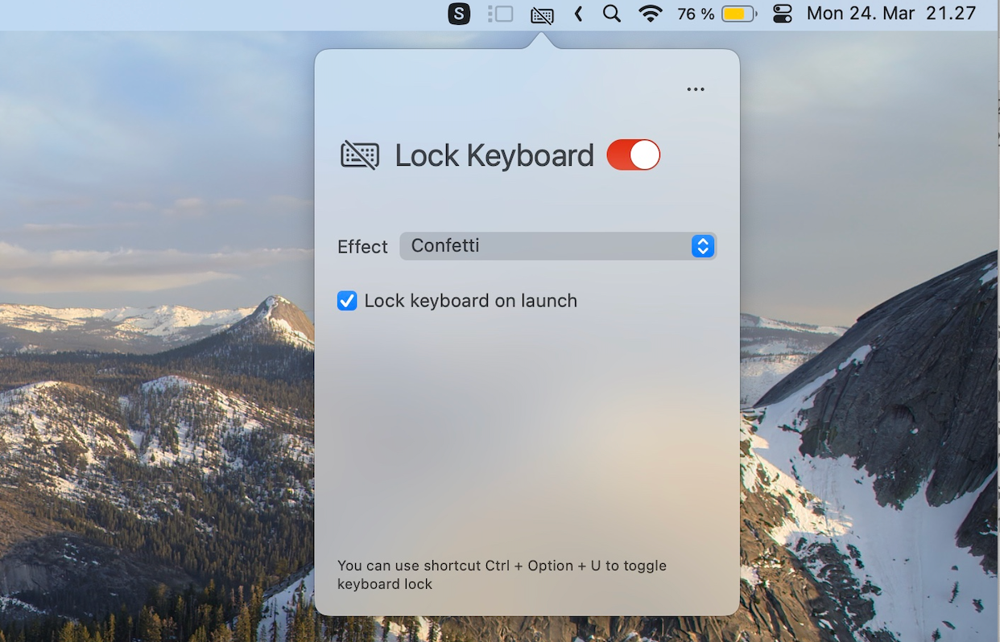

# BabyKeyboard Lock

Baby keyboard lock is a Macos app that can lock your keyboard, while your toddlers or kids can still have fun with it. Find more on official site https://keyboardlock.app/



## Table of Contents

- [Features](#features)
- [Development](#development)
  - [Building Locally](#building-locally)
  - [Installing Certificates on Another Mac](#installing-certificates-on-another-mac)
- [TODO](#todo)
- [Credits](#credits)

## Features

- Lock your keyboard to prevent unwanted inputs, including media keys and Power button
- Configurable fun effects, confetti, read the pressed key, read a word that starts with the pressed key, more effects coming.
- No visible window is created, so you can still read your webpage or movie as normal
- A Menu bar only App, and you can toggle keyboard lock with a global shortcut

## Development

### Building Locally

To build and deploy the app locally:

```bash
make deploy
```

This will clean, archive, export, and install the app to `/Applications/`.

### Installing Certificates on Another Mac

If you need to build the app on a different Mac (e.g., another family member's computer), you'll need to transfer the code signing certificate:

**On the original Mac (with the certificate):**

1. Open **Keychain Access**
2. Find the certificate: "Apple Development: petr.b.lavrov@gmail.com (8BH632TKSD)"
3. Right-click → **Export** → Save as `.p12` file
4. Set a strong password when prompted
5. Transfer the `.p12` file securely to the other Mac (via AirDrop, USB drive, etc.)

**On the new Mac:**

1. Double-click the `.p12` file to import it
2. Enter the password you set
3. Open **Keychain Access**
4. Find the imported certificate
5. **Double-click** the certificate → Expand **"Trust"** section
6. Change "When using this certificate:" to **"Always Trust"**
7. Close and enter your password to save

Now `make deploy` should work on the new Mac!

**Security note:** Delete the `.p12` file after importing, and don't share it via unencrypted channels.

## TODO

- ~~show window on launch~~
- ~~hide docker icon, only need menu bar~~
- ~~https://developer.apple.com/documentation/uikit/creating-custom-symbol-images-for-your-app~~
- Adding more effects
- whitelist / Blacklist by key codes
- Temporary lock by holding Fn ?
- Accessibility improvement
- Notarizing https://developer.apple.com/documentation/security/notarizing-macos-software-before-distribution
- Unit test

## Credits

- Sound effects are downloaded from https://freesound.org/
- This app is inspired by https://github.com/kfv/keylock/
